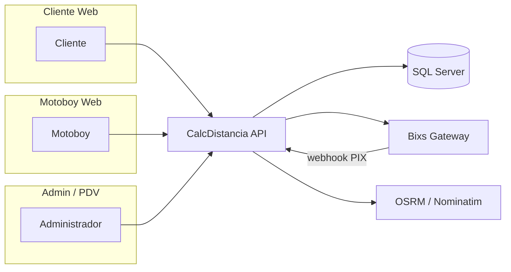
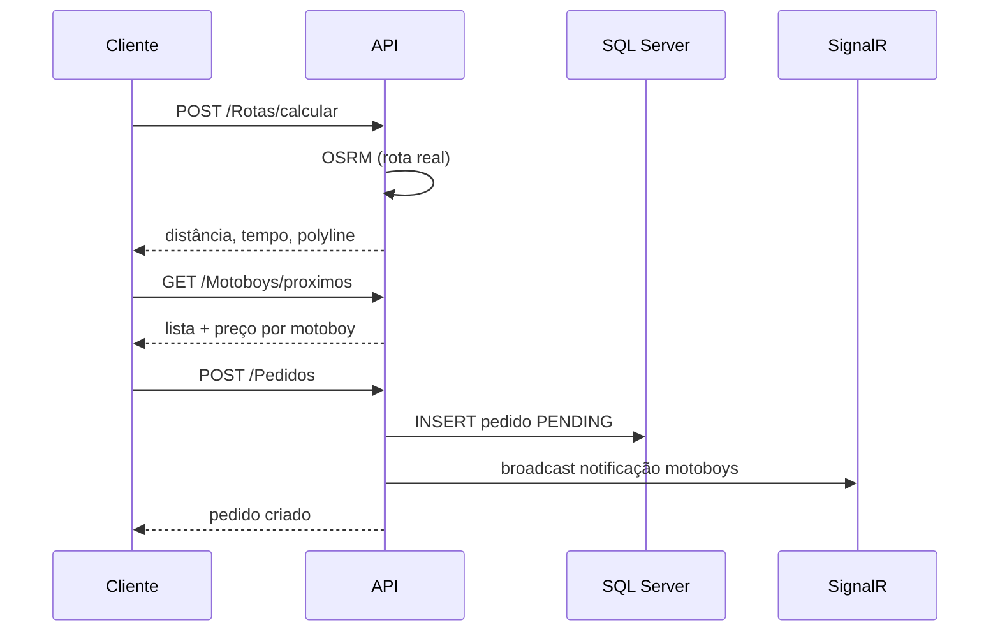
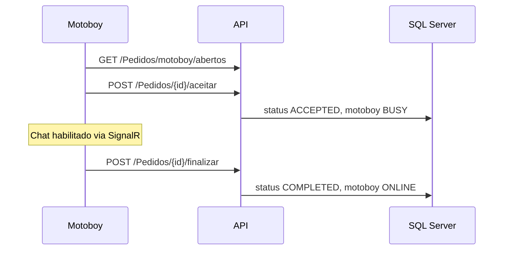
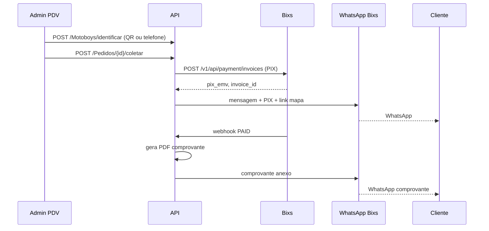

# 01 — Visão Geral

## Propósito

A API CalcDistancia centraliza toda a lógica de negócio do sistema de entregas:

- Cálculo de rotas e precificação por distância
- Gestão de pedidos e ciclo de vida da entrega
- Cadastro e monitoramento de motoboys
- Pagamento PIX via gateway Bixs (mesmo do PagWeb)
- Notificações WhatsApp ao **cliente** (coleta, PIX, comprovante)
- Notificações **internas** ao motoboy (SignalR — sem WhatsApp em massa)
- Chat cliente ↔ motoboy por pedido
- Painel administrativo (PDV / coleta no balcão)

## Atores

## Fluxos principais

### 1. Cliente cria pedido

### 2. Motoboy aceita e executa

### 3. Coleta no balcão + PIX + WhatsApp (Admin)

## Estados do pedido

| Status | Descrição | Transições permitidas |
|--------|-----------|----------------------|
| `PENDING` | Aguardando motoboy | → `ACCEPTED`, `PICKED_UP`, `CANCELLED` |
| `ACCEPTED` | Motoboy aceitou | → `PICKED_UP`, `COMPLETED`, `CANCELLED` |
| `PICKED_UP` | Coleta confirmada no PDV | → `COMPLETED`, `CANCELLED` |
| `COMPLETED` | Entrega finalizada | terminal |
| `CANCELLED` | Cancelado por cliente ou motoboy | terminal |

## Status do motoboy

| Status | Descrição |
|--------|-----------|
| `ONLINE` | Disponível para corridas |
| `BUSY` | Com pedido ativo (`ACCEPTED` ou `PICKED_UP`) |
| `OFFLINE` | Indisponível (manual ou inatividade) |

## Regras de negócio críticas

1. **Uma tabela de preço ativa por escopo** — sistema (`SYSTEM`) ou por motoboy (`MOTOBOY` + `ownerId`).
2. **Motoboy ocupado** não vê pedidos globais (`BROADCAST`), exceto pedidos `DIRECT` direcionados a ele.
3. **WhatsApp só para cliente** — motoboys recebem notificações via SignalR (requisito `projeto.md` §5).
4. **Credenciais Bixs nunca no frontend** — email/senha/permanent_token apenas no servidor.
5. **Unicidade** — e-mail e telefone únicos por usuário/motoboy.
6. **Privacidade** — motoboy com `publico = false` não aparece na busca de clientes.

## Fases de entrega da API

| Fase | Escopo |
|------|--------|
| **MVP** | Auth, pedidos, motoboys, tabelas preço, rotas |
| **Fase 2** | PIX Bixs, webhook, WhatsApp, coleta PDV, comprovante PDF |
| **Fase 3** | SignalR completo, favoritos, métricas admin, rate limiting |
