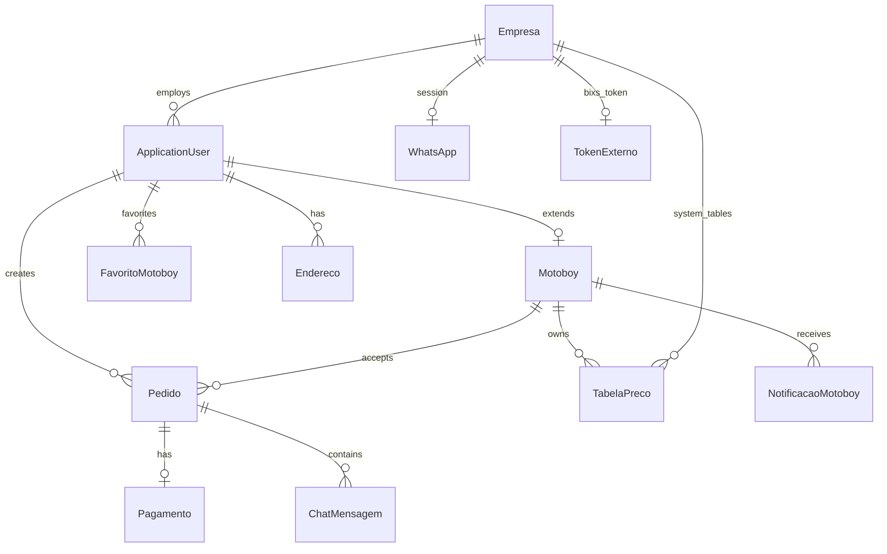

# 03 — Banco de Dados

## SGBD

**Microsoft SQL Server** — mesmo padrão PagWeb e Agendai (`UseSqlServer`).

Connection string em `appsettings.json`:

```json
{
  "ConnectionStrings": {
    "DbConect": "Server=...;Database=uaipdvco_calc_distancia;User Id=...;Password=...;TrustServerCertificate=true;"
  }
}
```

---

## Diagrama ER (simplificado)



---

## Tabelas

### `AspNetUsers` / `ApplicationUser`

Extensão do Identity (`Agendai/Models/Usuario.cs` como referência).

| Coluna | Tipo | Notas |
|--------|------|-------|
| `Id` | `nvarchar(450)` PK | GUID string |
| `UserName` | `nvarchar(256)` | |
| `Email` | `nvarchar(256)` | **UNIQUE** |
| `PhoneNumber` | `nvarchar(20)` | **UNIQUE** (índice filtrado onde not null) |
| `Nome` | `nvarchar(100)` | |
| `SobreNome` | `nvarchar(100)` | |
| `Cpf` | `nvarchar(14)` | |
| `Status` | `int` | Ativo/Inativo |
| `EmpresaId` | `int?` FK | Admin vinculado ao PDV |
| `DataCriacao` | `datetime2` | |

### `Motoboys`

| Coluna | Tipo | Notas |
|--------|------|-------|
| `Id` | `int` PK IDENTITY | |
| `UsuarioId` | `nvarchar(450)` FK UNIQUE | 1:1 com User |
| `Placa` | `nvarchar(10)` | |
| `Veiculo` | `nvarchar(20)` | MOTO, CARRO, BIKE |
| `Cidade` | `nvarchar(100)` | |
| `Bairro` | `nvarchar(100)` | |
| `Estado` | `nvarchar(2)` | UF |
| `Publico` | `bit` | default `true` |
| `Status` | `nvarchar(20)` | ONLINE, BUSY, OFFLINE |
| `UltimaLatitude` | `float` | |
| `UltimaLongitude` | `float` | |
| `UltimaLocalizacaoEm` | `datetime2` | |
| `QrPayload` | `nvarchar(500)` | JSON: `{ motoboyId, cpf, nome }` |

Índices:
- `IX_Motoboys_Status_Publico` em (`Status`, `Publico`)
- `IX_Motoboys_Geo` em (`UltimaLatitude`, `UltimaLongitude`) — ou geography SQL Server

### `Pedidos`

| Coluna | Tipo | Notas |
|--------|------|-------|
| `Id` | `nvarchar(50)` PK | ex: `PED-XXXX` |
| `ClienteId` | `nvarchar(450)` FK | |
| `ClienteNome` | `nvarchar(200)` | snapshot |
| `Status` | `nvarchar(20)` | PENDING, ACCEPTED, PICKED_UP, CANCELLED, COMPLETED |
| `ModoAtribuicao` | `nvarchar(20)` | BROADCAST, DIRECT |
| `MotoboyAlvoId` | `int?` FK | pedido direto |
| `MotoboyAceitoId` | `int?` FK | |
| `MotoboyColetaId` | `int?` FK | |
| `OrigemEndereco` | `nvarchar(500)` | |
| `OrigemLat` / `OrigemLng` | `float` | |
| `OrigemCep` / `Cidade` / `Estado` / `Bairro` | `nvarchar` | |
| `DestinoEndereco` | `nvarchar(500)` | |
| `DestinoLat` / `DestinoLng` | `float` | |
| `DestinoCep` / ... | | |
| `DistanciaKm` | `decimal(10,2)` | |
| `DuracaoMin` | `int` | |
| `Preco` | `decimal(10,2)?` | null = sob consulta |
| `FaixaPrecoLabel` | `nvarchar(100)` | |
| `TelefoneRastreio` | `nvarchar(20)` | |
| `PolylineJson` | `nvarchar(max)` | JSON `[[lat,lng],...]` |
| `StatusPagamento` | `nvarchar(20)` | NONE, PENDING, PAID |
| `PixInvoiceId` | `nvarchar(100)` | |
| `PixEmv` | `nvarchar(max)` | |
| `PagoEm` | `datetime2?` | |
| `CriadoEm` | `datetime2` | |
| `AceitoEm` | `datetime2?` | |
| `ColetadoEm` | `datetime2?` | |
| `FinalizadoEm` | `datetime2?` | |
| `CanceladoPor` | `nvarchar(20)?` | CLIENT, MOTOBOY |
| `CanceladoEm` | `datetime2?` | |

Índices:
- `IX_Pedidos_Cliente_Status` em (`ClienteId`, `Status`)
- `IX_Pedidos_Motoboy_Status` em (`MotoboyAceitoId`, `Status`)
- `IX_Pedidos_Status_Criado` em (`Status`, `CriadoEm`)

### `TabelasPreco`

| Coluna | Tipo | Notas |
|--------|------|-------|
| `Id` | `int` PK | |
| `Nome` | `nvarchar(100)` | |
| `TipoDono` | `nvarchar(20)` | SYSTEM, MOTOBOY |
| `MotoboyId` | `int?` FK | null se SYSTEM |
| `EmpresaId` | `int?` FK | tabela sistema do PDV |
| `Ativa` | `bit` | **apenas uma `true` por escopo** |
| `CriadoEm` | `datetime2` | |

**Constraint de negócio (aplicar no service):** ao ativar tabela X, desativar demais do mesmo `(TipoDono, MotoboyId)`.

### `FaixasPreco`

| Coluna | Tipo | Notas |
|--------|------|-------|
| `Id` | `int` PK | |
| `TabelaPrecoId` | `int` FK | |
| `MinKm` | `decimal(10,2)` | |
| `MaxKm` | `decimal(10,2)?` | null = aberto |
| `Preco` | `decimal(10,2)?` | null = sob consulta |
| `PrecoPorKm` | `decimal(10,2)?` | tier aberto |
| `Label` | `nvarchar(100)` | |
| `Ordem` | `int` | |

### `Pagamentos`

| Coluna | Tipo | Notas |
|--------|------|-------|
| `Id` | `int` PK | |
| `PedidoId` | `nvarchar(50)` FK UNIQUE | |
| `CodigoTransacao` | `nvarchar(100)` | external_code / invoice |
| `TransacaoId` | `nvarchar(100)` | cora_invoice_id Bixs |
| `Valor` | `decimal(10,2)` | |
| `Metodo` | `nvarchar(20)` | PIX |
| `Status` | `nvarchar(20)` | PENDING, PAID, CANCELLED, EXPIRED |
| `PixEmv` | `nvarchar(max)` | |
| `CriadoEm` | `datetime2` | |
| `PagoEm` | `datetime2?` | |
| `ComprovanteUrl` | `nvarchar(500)?` | path storage |

### `WhatsApps`

Espelhar `PagWebV1/Models/WhatsApp.cs` e `Agendai/Models/WhatsApp.cs`:

| Coluna | Tipo | Notas |
|--------|------|-------|
| `Id` | `int` PK | ID instância Bixs |
| `EmpresaId` | `int` FK | |
| `Sessao` | `nvarchar(50)` | ex: `CALC-1` |
| `Status` | `nvarchar(50)` | OPEN, CONNECTED, etc. |
| `Telefone` | `nvarchar(20)` | |
| `Criado` / `Atualizado` | `datetime2` | |

### `TokensExternos`

| Coluna | Tipo | Notas |
|--------|------|-------|
| `Id` | `int` PK | |
| `EmpresaId` | `int` FK | |
| `Token` | `nvarchar(max)` | Bearer Bixs |
| `PermanentToken` | `nvarchar(max)?` | |
| `ExpiraEm` | `datetime2` | |
| `AtualizadoEm` | `datetime2` | |

### `ChatMensagens`

| Coluna | Tipo | Notas |
|--------|------|-------|
| `Id` | `int` PK | |
| `PedidoId` | `nvarchar(50)` FK | |
| `RemetenteId` | `nvarchar(450)` | |
| `PapelRemetente` | `nvarchar(20)` | CLIENT, MOTOBOY |
| `NomeRemetente` | `nvarchar(100)` | |
| `Texto` | `nvarchar(2000)` | |
| `CriadoEm` | `datetime2` | |

### `NotificacoesMotoboy`

| Coluna | Tipo | Notas |
|--------|------|-------|
| `Id` | `int` PK | |
| `MotoboyId` | `int` FK | |
| `Titulo` | `nvarchar(200)` | |
| `Mensagem` | `nvarchar(1000)` | |
| `PedidoId` | `nvarchar(50)?` | |
| `Lida` | `bit` | |
| `CriadoEm` | `datetime2` | |

### `FavoritosMotoboy`

| Coluna | Tipo | |
|--------|------|--|
| `ClienteId` | `nvarchar(450)` PK part | |
| `MotoboyId` | `int` PK part | |
| `CriadoEm` | `datetime2` | |

### `Enderecos`

Reutilizar padrão `Agendai/Models/Endereco.cs`.

---

## Seed inicial

```csharp
// Roles
"Admin", "Cliente", "Motoboy"

// Tabela preço sistema default (projeto.md)
0-5 km   → R$ 10
6-10 km  → R$ 15
11-20 km → R$ 25
21-50 km → R$ 50
> 50 km  → R$ 50 + R$ 2/km acima de 50
```

---

## Migrations

```powershell
dotnet ef migrations add InitialCreate -o Migrations
dotnet ef migrations add PedidosEPagamentos
dotnet ef database update
```

Manter `Migrations/` versionado no git (submódulo ou pasta dentro de `api/`, como PagWeb).
