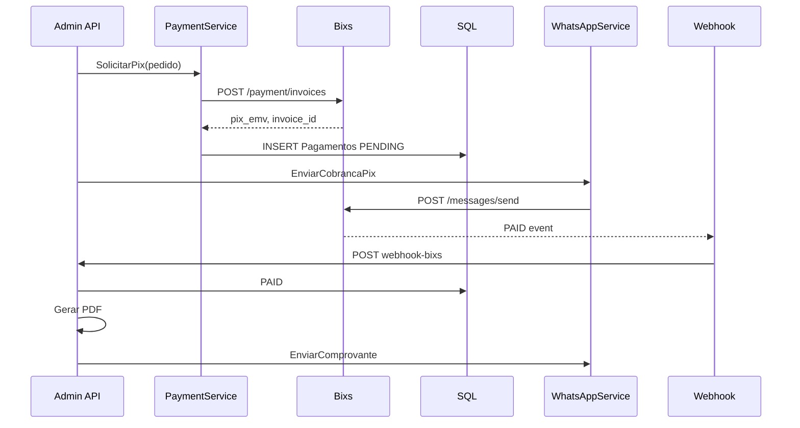

# 06 — Integração Bixs (Pagamentos + WhatsApp)

Toda comunicação com o **Gateway Bixs** (`https://api.bixs.com.br`) deve ocorrer **exclusivamente no backend**. O frontend atual expõe credenciais via `VITE_BIXS_*` — isso deve ser removido após migração.

Referências no monorepo:
- `PagWebV1/Services/PaymentService.cs`
- `PagWebV1/Services/ExternalTokenManagerService.cs`
- `PagWebV1/Controllers/PagamentoController.cs` (webhook `repasse-bixs`)
- `Agendai/Controllers/WhatsAppController.cs`
- `Agendai/Services/PagamentoService.cs`
- `Agendai/Services/ExternalToken.cs`

---

## Configuração (`appsettings.json`)

```json
{
  "BixAPI": {
    "BaseUrl": "https://api.bixs.com.br",
    "Email": "conta-gateway@empresa.com.br",
    "Password": "***",
    "Mac": "calc-distancia-api",
    "Source": "api_externa"
  },
  "WhatsApp": {
    "InstanceNamePrefix": "CALC",
    "TestPhoneRedirect": "31999999999"
  },
  "Pagamentos": {
    "WebhookBaseUrl": "https://calc-distancia.api.uaipdv.com.br/api/Pagamentos/webhook-bixs"
  }
}
```

Em **Development**, redirecionar destino WhatsApp para `TestPhoneRedirect` (equivalente a `VITE_BIXS_TEST_PHONE` no front).

---

## Autenticação Bixs

### `POST /v1/auth/login`

**Service:** `ExternalTokenService.GetValidTokenAsync(empresaId)`

**Payload** (igual front `getBixsAuthPayload()`):

```json
{
  "email": "...",
  "password": "...",
  "mac": "calc-distancia-api",
  "source": "api_externa"
}
```

**Response:**

```json
{
  "token": "eyJ...",
  "permanent_token": "...",
  "expires_in": 3600
}
```

Persistir em `TokensExternos` com `ExpiraEm = UtcNow + expires_in - buffer(5min)`.

`TokenRefreshWorker` (Agendai) renova em background.

---

## Pagamentos PIX

### Criar invoice

**`POST /v1/api/payment/invoices`**

Copiar DTOs de `PagWebV1/Dtos/Payment.cs`:

```csharp
public class PaymentRequestDto
{
    [JsonPropertyName("amount")] public int Amount { get; set; } // centavos
    [JsonPropertyName("payment_type")] public string PaymentType { get; set; } = "PIX";
    [JsonPropertyName("due_date")] public string DueDate { get; set; }
    [JsonPropertyName("external_code")] public string ExternalCode { get; set; }
    [JsonPropertyName("service_name")] public string ServiceName { get; set; }
    [JsonPropertyName("service_desc")] public string ServiceDesc { get; set; }
    [JsonPropertyName("customer_payment")] public CustomerPaymentRequestDto CustomerPayment { get; set; }
    [JsonPropertyName("location")] public LocationRequestDto Location { get; set; }
}
```

**Exemplo CalcDistancia — coleta pedido:**

```csharp
var payment = new PaymentRequestDto
{
    Amount = (int)(pedido.Preco * 100),
    PaymentType = "PIX",
    DueDate = DateTime.UtcNow.ToString("yyyy-MM-dd"),
    ExternalCode = pedido.Id, // ou Guid
    ServiceName = $"Entrega {pedido.Id}",
    ServiceDesc = $"Coleta confirmada: {pedido.OrigemEndereco} → {pedido.DestinoEndereco}",
    CustomerPayment = new CustomerPaymentRequestDto
    {
        Name = pedido.ClienteNome,
        Email = cliente.Email,
        Phone = pedido.TelefoneRastreio,
        Document = cliente.Cpf,
        DocumentType = "CPF",
        Address = new AddressDto { /* endereço cliente ou origem */ }
    },
    Location = new LocationRequestDto
    {
        Latitude = pedido.OrigemLat,
        Longitude = pedido.OrigemLng,
        City = pedido.OrigemCidade,
        Ip = httpContext.Connection.RemoteIpAddress?.ToString()
    }
};

var token = await _externalToken.GetValidTokenAsync(empresaId);
var result = await _paymentService.SolicitacaoPagamentoAsync(payment, token);
```

**Response relevante:**

| Campo | Uso |
|-------|-----|
| `pix_emv` | Copia e cola PIX → WhatsApp |
| `cora_invoice_id` / `id` | `TransacaoId` no banco |
| `status` | PENDING |

### Consultar status (opcional)

**`GET /v1/api/payment/invoices/{invoiceId}`**

Polling fallback se webhook falhar.

---

## Webhook PIX (callback)

Espelhar `PagWebV1/Controllers/PagamentoController.cs` → `repasse-bixs/{idEmpresa}`  
e `Agendai/Controllers/PagamentosController.cs` → `Confirmar/{id}`.

### `POST /api/Pagamentos/webhook-bixs/{empresaId}`

**Auth:** `AllowAnonymous` — validar assinatura/IP Bixs se disponível.

**Body** (`PagamentoRepasse` — Agendai):

```json
{
  "deliveredAt": "2026-07-29T12:00:00Z",
  "data": {
    "invoiceId": "cora_inv_xxx",
    "status": "PAID"
  }
}
```

**Fluxo ao receber `PAID`:**

1. Localizar `Pagamentos` por `TransacaoId == invoiceId`
2. Atualizar `Status = PAID`, `PagoEm = deliveredAt`
3. Atualizar `Pedidos.StatusPagamento = PAID`, `PagoEm`
4. `ReceiptService.GerarComprovantePdfAsync(pedido, pagamento)`
5. Upload PDF → Bixs media **ou** storage local com URL pública
6. `WhatsAppService.EnviarComprovanteAsync(telefoneRastreio, pdfUrl)`

Registrar webhook na Bixs no primeiro login admin (PagWeb faz em `ExternalTokenManagerService`).

---

## WhatsApp

### Base URL messages

```
https://api.bixs.com.br/v1/api/message/
```

### Instâncias

| Operação | Método Bixs | Controller |
|----------|-------------|------------|
| Listar | `GET instances` | sync no Obter-QrCode |
| Criar | `POST instances` `{ "name": "CALC-1" }` | Obter-QrCode |
| Status | `GET instances/{id}/status` | Status |
| QR | `GET instances/{id}/qrcode` | Obter-QrCode |
| Deletar | `DELETE instances/{id}` | Desconectar |

Nome instância: `{InstanceNamePrefix}-{empresaId}` → `CALC-1`.

### Enviar mensagem

**`POST /v1/api/messages/send`**

```json
{
  "instance_id": 123,
  "to": "5531999999999",
  "to_name": "Cliente",
  "message": "✅ Coleta confirmada!...",
  "document_url": "https://.../comprovante.pdf",
  "image_url": "",
  "audio_url": "",
  "video_url": ""
}
```

### Templates de mensagem (migrar de `whatsappApi.ts`)

**Cobrança PIX (coleta):**

```
✅ *Coleta confirmada!*

📦 De: {origem}
📍 Para: {destino}

💰 Valor: R$ {valor}

🔗 *Pagamento PIX (Copia e Cola):*
{pixEmv}

🗺️ *Destino no mapa:*
https://maps.google.com/?q={destinoLat},{destinoLng}
```

**Comprovante:**

```
✅ *Pagamento confirmado!*

Agradecemos a preferência. Segue o comprovante do seu pedido em anexo.
```

**Notificação cliente (motoboy aceitou):**

```
🛵 *Sua entrega foi aceita!*

Motoboy: {nome}
Previsão: {duracaoMin} min
```

> **Não enviar WhatsApp para motoboys** — usar SignalR (requisito projeto).

### Upload mídia (comprovante PDF)

**`POST /v1/api/upload/media`**

`multipart/form-data` com arquivo PDF → retorna `media_url` para `document_url` no send.

---

## `PaymentService.cs` (copiar/adaptar)

```csharp
public class PaymentService : IPaymentService
{
    private readonly HttpClient _httpClient;
    private readonly IConfiguration _config;

    public async Task<PaymentResponseDto> SolicitacaoPagamentoAsync(
        PaymentRequestDto request, string token)
    {
        var url = $"{_config["BixAPI:BaseUrl"]}/v1/api/payment/invoices";
        _httpClient.DefaultRequestHeaders.Authorization =
            new AuthenticationHeaderValue("Bearer", token);

        var response = await _httpClient.PostAsJsonAsync(url, request);
        response.EnsureSuccessStatusCode();
        return await response.Content.ReadFromJsonAsync<PaymentResponseDto>();
    }
}
```

---

## `WhatsAppService.cs` — interface sugerida

```csharp
public interface IWhatsAppService
{
    Task<WhatsAppSessionDto> GetOrCreateSessionAsync(int empresaId);
    Task<string> GetStatusAsync(int empresaId);
    Task<string> GetQrCodeAsync(int empresaId);
    Task DisconnectAsync(int empresaId);
    Task SendTextAsync(int empresaId, string to, string toName, string message);
    Task SendDocumentAsync(int empresaId, string to, string toName, string message, string documentUrl);
    Task EnviarCobrancaPixAsync(Pedido pedido, string pixEmv);
    Task EnviarComprovanteAsync(Pedido pedido, string comprovanteUrl);
}
```

---

## Segurança

| Risco atual (front) | Mitigação API |
|---------------------|---------------|
| Credenciais Bixs no bundle Vite | `appsettings` + User Secrets / Azure Key Vault |
| Qualquer usuário gera PIX | Apenas `Admin` em `coletar` |
| Webhook spoofing | Validar IP/secret Bixs; idempotência por `invoiceId` |
| PIX EMV exposto em logs | Mascarar em logs; TTL curto |

---

## Diagrama pagamento completo


